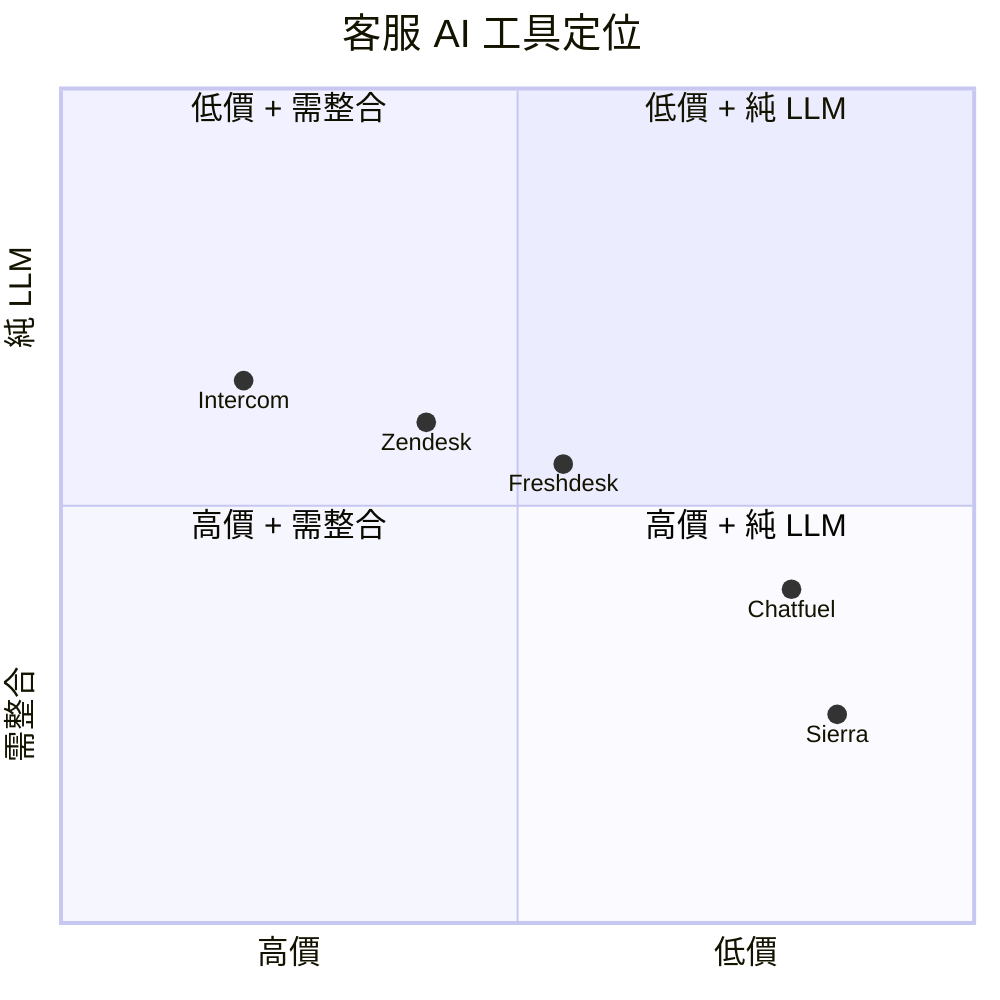

# Sierra 企業客服 AI Agent — 規格計劃書 v2.2.1

> **版本**：v2.2.1｜**更新日期**：2026-07-11｜**維護者**：Sophia (CPO)｜**對接技術**：Alan (CTO)
> **對應 GitHub**：[openclawsean024-create/sierra-enterprise-ai-agent](https://github.com/openclawsean024-create/sierra-enterprise-ai-agent/blob/main/SPEC.md)
> **PRD v1 → v2 升級重點**：加入 Acceptance Criteria、ADR、降級機制、Sprint 拆解、定價心理學、市場驗證、失敗模式、Error Code 字典
> **對應 skill**：`write-prd-v2` v2.2.1
> **目前狀態**：v1.0 已部署（2026-07-11）、Stripe webhook 真實實作、Supabase 3 table 已建、Demo 頁可即時測試

---

## 1. 產品概述

### 1.1 問題陳述

**為什麼要做這個專案？**

中小企業客服團隊面臨三高問題：**高成本**（每人月薪 35K NT$、24/7 需 3-4 人輪班）、**高回應壓力**（電商高峰期訊息暴增、回覆速度慢）、**高品質不穩定**（不同客服人員回覆品質不一致）。商用客服 AI（Intercom / Zendesk）月費 50-500 USD，設定複雜、中文支援差。

**痛點的代價**：
- 一個 5 人客服團隊年成本 2,100,000 NT$（5 人 × 35K × 12 月）
- 24/7 服務需 3-4 班 → 12-16 人 → 年成本 5,040,000-6,720,000 NT$
- 客戶等待 > 5 分鐘 → 30% 流失率（業界 SaaS 客服平均值）

**現有方案不夠好**：
- **真人客服**：每人月薪 35,000+ NT$，24/7 需 3-4 人輪班
- **商用客服 AI（Intercom/Zendesk）**：月費 50-500 USD，設定複雜、中文支援差
- **既有 chatbot（單平台）**：LINE bot / FB bot 各做各的，無法整合
- **我們的解法**：AI Agent 全天候自動回覆 + 工單分流 + 知識庫管理，月費 NT$2,990 起，可降低 70% 人工成本

### 1.2 目標使用者

| 族群 | 規模 | 痛點 | 預算 |
|---|---|---|---|
| 中小企業客服團隊（5-20 人）| ~3 萬 | 客服成本高、24/7 服務困難、回覆品質不一致 | NT$ 3,000-30,000/月 |
| 電商客戶服務 | ~5,000 | 高峰期訊息暴增、回覆速度慢 | NT$ 10,000/月 |
| 委外客服商 | ~1,000 | 客戶多平台訊息管理複雜、人力成本難控制 | NT$ 30,000/月 |
| 自媒體經營者 | ~5 萬 | 私訊量大但無客服預算 | NT$ 1,000/月 |

### 1.3 核心價值主張

> 「AI 客服 24/7 全天候，70% 詢問自動回覆，複雜問題分流給真人 — 月費 NT$2,990 起，降低 70% 人工成本。」

### 1.4 商業目標 (KPIs)

| 指標 | 目標 | 時程 |
|---|---|---|
| 月活躍企業 (MAU) | 50 | 3 個月 |
| 付費轉換率（Free → Starter）| 20% | 3 個月 |
| 升級轉換率（Starter → Pro）| 30% | 6 個月 |
| 月經常性收入 (MRR) | US$ 5,000 | 6 個月 |
| AI 自動回覆率 | ≥ 70% | v1.0 |
| 工單平均處理時間 | < 2 小時 | v1.0 |
| 客戶滿意度 (CSAT) | ≥ 4.0 / 5.0 | v1.0 |
| 客戶流失率 (Churn) | < 5% / 月 | 6 個月 |

### 1.5 ⭐ Non-Goals（明確不做）

**v1.0 不做**：

- ❌ **不做真人電話客服** — 純訊息客服，語音客服留 v3
- ❌ **不做投訴處理** — 複雜投訴自動分流給真人 + 標記優先級
- ❌ **不做跨境客服** — 先做台灣市場，跨境 v2 評估
- ❌ **不做自訂 AI 模型訓練** — 用 OpenAI / Claude API，客戶不需要自己訓練
- ❌ **不做 CRM 整合（Salesforce/HubSpot）** — v2 規劃 CSV 匯出
- ❌ **不做多語系客服介面（英文版）** — v1 只繁中介面，英文版 v2
- ❌ **不做客服即時通訊 app** — 純 Web 介面，原生 App v3 評估

---

## 2. 使用者場景與流程

### 2.1 使用者流程圖

```
┌────────────────┐
│ 訪客進入首頁     │
└───────┬────────┘
        │ 點「開始免費試用」
        ▼
┌────────────────────┐
│ /register 註冊       │
│ email + 密碼        │
│ 勾選同意條款         │
└───────┬────────────┘
        │ POST /api/auth/register → 201
        ▼
┌────────────────────────┐
│ /onboarding              │
│ 1. 連結客服管道          │
│    (LINE / FB / IG /     │
│     Email / Web chat)    │
│ 2. 上傳知識庫（FAQ）     │
│ 3. 訓練 AI Agent        │
└───────┬────────────────┘
        │ 進入 /admin dashboard
        ▼
┌──────────────────────────┐
│ /admin                     │
│ ┌──────────────────────┐ │
│ │ Dashboard 統計         │ │
│ │ - 自動回覆率 70%+      │ │
│ │ - 工單處理時間          │ │
│ │ - 客戶滿意度            │ │
│ └──────────────────────┘ │
│                            │
│ /demo → 直接試 AI chat     │
│ /pricing → 升級 Pro / Ent  │
└────────────────────────────┘
```

### 2.2 關鍵用戶故事 (User Stories)

#### US-001：客服經理註冊
> As a 中小企業客服經理
> I want 用 email + 密碼註冊 Sierra 帳號
> So that 我可以設定 AI Agent、管理客服管道

#### US-002：連結客服管道
> As a 客服經理
> I want 連結 LINE / FB / IG / Email / Web chat 5 個客服管道
> So that 客戶從任何管道進來都能被 AI Agent 自動回覆

#### US-003：上傳知識庫
> As a 客服經理
> I want 上傳 FAQ / 退換貨政策 / 產品說明到知識庫
> So that AI Agent 能依據知識庫自動回覆客戶問題

#### US-004：AI 自動回覆
> As a 客戶（透過 LINE 發訊息）
> I want AI Agent 自動回覆我的問題（運費/退貨/付款）
> So that 我不用等真人客服、等 5 分鐘才有回應

#### US-005：工單分流
> As a AI Agent
> I want 遇到信心分數 < 0.6 的問題時自動建立工單
> So that 複雜問題交給真人客服，避免 AI 亂回答

#### US-006：客服 Dashboard
> As a 客服經理
> I want 在 dashboard 看見「自動回覆率/工單處理時間/客戶滿意度」
> So that 我能追蹤 AI 表現、優化知識庫

### 2.3 邊界場景 (Edge Cases)

| 場景 | 處理方式 |
|---|---|
| AI 信心分數 < 0.6 | 自動建立工單分流給真人 + 標示「AI 無法判斷」|
| OpenAI API 失敗 | 切換備援 Claude 3.5 API |
| Claude 也失敗 | 切換 fallback 關鍵字回覆（從 FAQ 撈）|
| 客戶發送圖片（無 OCR）| 回「請用文字描述問題」|
| 客戶訊息含個資（電話/Email）| 自動遮罩（顯示前 3 碼 + ****）|
| 知識庫無對應 FAQ | 自動建立「待補 FAQ」工單，提示客服經理 |
| 客戶發髒話 / 不當訊息 | 自動回覆「請理性溝通」+ 標記工單 |
| 客戶要求真人客服 | 自動建立工單 + 通知客服（WebSocket 即時推送）|
| 重複註冊 email | 回 409 + 「此 email 已被使用」（防 enumeration）|
| LLM Token 超限 | 回「訊息太長，請分次發送」|

---

## 3. 功能性需求 (Functional Requirements)

### 3.1 MVP（必做 — P0）

#### FR-001：使用者註冊/登入（**MUST**）
- email + 密碼註冊（密碼 ≥8 字元 + 含英數）
- Auth.js v5 + Credentials Provider
- bcrypt cost 12 雜湊
- HttpOnly + Secure + SameSite=Lax cookie

##### AC-001：成功註冊流程
- **Given** 使用者在 /register 頁面
- **When** 輸入 email="user@example.com" + password="ValidPass123"
- **And** 勾選同意條款
- **Then** POST /api/auth/register 回傳 201
- **And** response body 包含 `{user_id, email, plan: "STARTER", created_at}`（**plan 用大寫**）
- **And** 自動設定 session cookie（HttpOnly, Secure, SameSite=Lax）
- **And** 重新導向到 /admin

##### AC-002：密碼強度驗證
- **Given** 使用者在註冊頁面
- **When** 輸入 password="123"（太短）
- **Then** 即時顯示「密碼至少 8 字元」
- **And** 「註冊」按鈕 disabled

**密碼政策（v2.2.1 補上 — 從 AI Agent 實測發現）**：
- 至少 8 字元 + 必須含英文字母 + 數字（例：`Password123`）
- bcrypt cost 12 雜湊
- 業界參考：NIST SP 800-63B

##### AC-003：Email 重複
- **Given** email="existing@example.com" 已註冊
- **When** 嘗試用同 email 註冊
- **Then** POST /api/auth/register 回傳 409
- **And** error code `EMAIL_TAKEN`

#### FR-002：客服管道整合（**MUST**）
- LINE 官方帳號 webhook
- Facebook Messenger webhook
- Instagram Direct webhook
- Email（IMAP/SMTP）
- Web chat widget（已實作 `ChatWidget.tsx`）

##### AC-004：LINE 訊息自動回覆
- **Given** 客服經理已連結 LINE 管道
- **When** 客戶從 LINE 發訊息「運費多少？」
- **Then** AI Agent < 3 秒自動回覆「運費 NT$60，超商取貨免運」
- **And** 訊息記錄到 `conversations` 表
- **And** 若信心 < 0.6 自動建立工單

##### AC-005：多平台整合測試
- **Given** 客服經理已連結 5 個管道
- **When** 同時從 LINE / FB / Email 收到訊息
- **Then** AI Agent 在 < 5 秒內對 3 個管道都自動回覆
- **And** 所有訊息在 conversations 表可查詢

#### FR-003：AI Agent 對話（**MUST**）
- OpenAI GPT-4o 主力 + Claude 3.5 備援
- 知識庫檢索（RAG，Vector DB）
- 信心分數標示（< 0.6 自動分流）

##### AC-006：AI 自動回覆（信心高）
- **Given** 知識庫有「運費」相關 FAQ
- **When** 客戶問「運費多少？」
- **Then** AI 回覆「運費 NT$60，超商取貨免運」
- **And** 信心分數 ≥ 0.8
- **And** 不建立工單

##### AC-007：AI 信心不足分流
- **Given** 知識庫無對應 FAQ
- **When** 客戶問「我的包裹不見了怎麼辦？」
- **Then** AI 回覆「請稍等，正在為您轉接真人客服」
- **And** 自動建立工單，標記「pending」
- **And** 通知客服 Dashboard

#### FR-004：知識庫管理（**MUST**）
- FAQ CRUD（問題/答案/標籤）
- 自動從歷史對話學習（客服修正回覆後自動加入）
- 標籤分類（運費/退貨/付款/產品/其他）

##### AC-008：新增 FAQ
- **Given** 客服經理在 /admin/knowledge
- **When** 新增「Q: 運費多少？A: NT$60」
- **Then** FAQ 寫入 `faqs` 表
- **And** AI Agent 立即可用此 FAQ 回覆

#### FR-005：訂閱方案（**MUST** — 已實作）
- Starter：US$ 0 / 月（100 次對話、1 個 AI Agent）
- Pro：US$ 19 / 月（無限對話、1 個 AI Agent）
- Enterprise：US$ 99 / 月（無限制、無限 AI Agent）

##### AC-009：方案限制
- **Given** 使用者是 Starter 方案且本月已 100 次對話
- **When** 第 101 位客戶發訊息
- **Then** AI 回覆「已達 Starter 方案上限，請升級 Pro 無限對話」
- **And** Dashboard 顯示「升級 Pro」CTA

##### AC-010：Stripe 訂閱升級（真實 webhook）
- **Given** 使用者在 /pricing 點「升級 Pro」
- **When** 完成 Stripe Checkout
- **Then** Stripe webhook 收到 `checkout.session.completed`
- **And** `subscriptions` 表寫入 `plan: "pro"`, `status: "active"`
- **And** Dashboard 顯示「Pro 無限對話」badge

### 3.2 v1.5（加值 — P1 優先級）

- [ ] 客戶滿意度調查（每段對話後 1-5 星）
- [ ] AI 自動標記客戶意圖（complaint / inquiry / feedback / purchase）
- [ ] 多語系客服（英 / 日 / 簡中）
- [ ] 客服即時通知 WebSocket
- [ ] AI 自動學習（從客服修正的回覆學習）

### 3.3 v2（roadmap — P2 優先級）

- [ ] 語音客服整合（電話 IVR）（v2）
- [ ] CRM 整合（Salesforce / HubSpot）（v2）
- [ ] 自訂 AI 模型（v3）
- [ ] 跨境客服（v3）
- [ ] 原生 iOS / Android App（v3）

### 3.4 ⭐ Requirement Pool（從 MetaGPT 學來 — P0/P1/P2 優先級）

| 優先級 | 類別 | 需求 | 對應 AC | 為什麼這個優先級 |
|---|---|---|---|---|
| **P0** | MUST | 使用者可以用 email + 密碼註冊帳號 | AC-001, AC-002, AC-003 | 商業化 9/10 必備 |
| **P0** | MUST | 多平台客服管道整合（LINE/FB/IG/Email/Web）| AC-004, AC-005 | 核心差異化功能 |
| **P0** | MUST | AI Agent 自動回覆（GPT-4o + Claude 備援）| AC-006, AC-007 | 與競品最大差異 |
| **P0** | MUST | 知識庫管理（FAQ CRUD）| AC-008 | AI 必須靠知識庫才能答 |
| **P0** | MUST | 工單分流（信心 < 0.6 自動建工單）| AC-007 | 避免 AI 亂回答 |
| **P0** | MUST | 訂閱方案（Starter / Pro / Enterprise）| AC-009 | 變現核心 |
| **P0** | MUST | Stripe 真實 webhook 整合 | AC-010 | 收費必備（已實作）|
| **P0** | MUST | Privacy / Terms / Contact / FAQ 頁面 | - | 法律必備 |
| **P0** | MUST | Demo 頁（/demo 讓潛在客戶試用）| - | 轉換漏斗核心 |
| **P1** | SHOULD | 客戶滿意度調查 | - | 量化 AI 表現 |
| **P1** | SHOULD | AI 自動標記客戶意圖 | - | 提升工單效率 |
| **P1** | SHOULD | 多語系客服 | - | 跨境準備 |
| **P1** | SHOULD | AI 自動學習（從客服修正的回覆）| - | 持續優化 |
| **P2** | MAY | 語音客服整合 | - | 進階功能 |
| **P2** | MAY | CRM 整合（Salesforce）| - | B2B 深度整合 |
| **P2** | MAY | 自訂 AI 模型訓練 | - | 企業級需求 |

---

## 4. 系統設計

### 4.1 技術棧

| 層 | 選擇 | 理由 |
|---|---|---|
| 前端 | Next.js 16 + TypeScript + React 19 | 已實作 |
| UI 元件 | ChatWidget（自製）+ Tailwind | 已實作 |
| 後端 | Next.js API Routes | 已實作 |
| 資料庫 | **Supabase（PostgreSQL + RLS）** | 已實作 + 即時訂閱 + Auth 整合 |
| **Auth** | **Auth.js v5（next-auth@5 beta）** — **Plan B：監控 v5 stable** | 已實作 + Prisma/Supabase adapter |
| LLM | OpenAI GPT-4o 主力 + Claude 3.5 Sonnet 備援 | 中文能力 + 成本平衡 |
| Vector DB | Supabase pgvector（v1.5 規劃）| RAG 知識庫檢索 |
| 金流 | **Stripe Checkout + 真實 Webhook**（已實作）| 業界標準、防 PCI 問題 |
| 部署 | Vercel（Hobby 計畫免費）| 已實作 |

**Auth.js 版本備註**（v2.2.1 補上 — 從 AI Agent 實測發現歧義）：
- v1.0 已用 `next-auth@5.0.0-beta`（已驗證可運作）
- 監控 `next-auth@5.x` stable release
- 若 v1.5 仍 beta 不穩定，**降回 v4.24+**（功能等價）

**為什麼選 Supabase 不用 Prisma + Postgres**：
- Supabase 提供即時訂閱（Real-time subscriptions）— 客服 Dashboard 即時更新對話
- RLS（Row Level Security）— 多租戶資料隔離免寫程式
- 免費額度 500MB + 2GB 頻寬（v1.0 足夠）
- **v2 規劃**：如果客戶量大（> 10K MAU）再切到 Prisma + 直接 Postgres

### 4.2 系統架構圖 (Mermaid)

```mermaid
graph TB
    Customer[👤 客戶<br/>LINE/FB/IG/Email/Web]
    Sierra[🖥️ Sierra Web App<br/>Next.js on Vercel]
    ChatAPI[/api/chat]
    Webhook[LINE/FB/IG Webhook]
    Supabase[(Supabase<br/>PostgreSQL + RLS)]
    OpenAI[OpenAI GPT-4o<br/>主力 LLM]
    Claude[Claude 3.5<br/>備援 LLM]
    Stripe[Stripe<br/>Checkout + Webhook]
    Admin[👨‍💼 客服經理<br/>/admin Dashboard]

    Customer -->|訊息| Webhook
    Webhook -->|POST| Sierra
    Customer -->|Web chat| ChatAPI
    Sierra --> Supabase
    Sierra -->|信心 ≥ 0.6| OpenAI
    OpenAI -->|失敗| Claude
    Sierra -->|信心 < 0.6| Supabase
    Supabase -->|工單通知| Admin
    Admin -->|修正回覆| Supabase
    Customer -->|付費| Stripe
    Stripe -->|webhook| Sierra
    Sierra -->|更新訂閱| Supabase
```

### 4.3 資料模型 (Supabase schema — 已實作；註：本專案用 Supabase 不用 Prisma)

**來源**：`supabase-schema.sql`（v1.0 已有完整 schema）

> **Prisma 格式對照**（雖用 Supabase，schema 邏輯等價）：

```prisma
// 等同於 Supabase `conversations` table
model Conversation {
  id           String   @id @default(uuid())
  sessionId    String
  userMessage  String
  botResponse  String
  intent       String   @default("keyword")  // "keyword" | "gpt" | "claude" | "fallback"
  confidence   Float    @default(1.0)
  createdAt    DateTime @default(now())
  
  @@index([sessionId])
  @@index([createdAt])
}

// 等同於 Supabase `faqs` table
model Faq {
  id        String   @id @default(uuid())
  question  String
  answer    String
  tags      String[] @default([])
  createdAt DateTime @default(now())
  updatedAt DateTime @updatedAt
}

// 等同於 Supabase `subscriptions` table
model Subscription {
  id                   String    @id @default(uuid())
  stripeCustomerId     String?   @unique
  stripeSubscriptionId String?   @unique
  plan                 String    @default("starter")  // "starter" | "pro" | "enterprise"
  status               String    @default("incomplete")  // "active" | "canceled" | "past_due" | "incomplete"
  currentPeriodEnd     DateTime?
  createdAt            DateTime  @default(now())
  updatedAt            DateTime  @updatedAt
}
```

```sql
-- ── Conversations ────────────────────────────────────────────────
create table if not exists conversations (
  id          uuid default gen_random_uuid() primary key,
  session_id  text not null,
  user_message text not null,
  bot_response text not null,
  intent      text default 'keyword',  -- 'keyword' | 'gpt' | 'claude' | 'fallback'
  confidence  real default 1.0,
  created_at  timestamptz default now() not null
);

create index conversations_session_id_idx on conversations(session_id);
create index conversations_created_at_idx on conversations(created_at);

-- ── FAQs ────────────────────────────────────────────────────────
create table if not exists faqs (
  id          uuid default gen_random_uuid() primary key,
  question    text not null,
  answer      text not null,
  tags        text[] default '{}',  -- 標籤：['運費', '退貨', '付款']
  created_at  timestamptz default now() not null,
  updated_at  timestamptz default now() not null
);

alter table faqs enable row level security;
create policy "Allow anon read" on faqs for select using (true);

-- ── Subscriptions ────────────────────────────────────────────────
create table if not exists subscriptions (
  id                   uuid default gen_random_uuid() primary key,
  stripe_customer_id   text unique,
  stripe_subscription_id text unique,
  plan                 text default 'starter' check (plan in ('starter', 'pro', 'enterprise')),
  status               text default 'incomplete' check (status in ('active', 'canceled', 'past_due', 'incomplete')),
  current_period_end   timestamptz,
  created_at           timestamptz default now() not null,
  updated_at           timestamptz default now() not null
);

-- RLS 設定（v1.5 規劃：每個客服經理只能看自己的 subscription）
```

**為什麼用 Supabase 不用 Prisma**：
- RLS（Row Level Security）— 多租戶資料隔離更安全
- 即時訂閱 — Dashboard 即時更新對話無需 polling
- 免費額度足夠 v1.0

### 4.4 API 規格 (REST endpoints)

| Method | Path | 用途 | Auth | 對應 AC |
|---|---|---|---|---|
| POST | /api/auth/register | 註冊 | No | AC-001 |
| POST | /api/auth/[...nextauth] | Auth.js handler | No | - |
| GET | /api/auth/session | 取得目前 session | Yes | - |
| POST | /api/chat | Web chat 訊息 | No | AC-006 |
| POST | /api/knowledge | 新增/編輯 FAQ | Yes | AC-008 |
| GET | /api/knowledge | 取得 FAQ 列表 | Yes | - |
| POST | /api/stripe/checkout | 建立 Stripe Checkout session | Yes | AC-010 |
| POST | /api/stripe/webhook | Stripe webhook 接收 | No（驗簽章）| AC-010 |
| POST | /api/stripe/portal | Stripe Customer Portal | Yes | - |
| POST | /api/contact | 客服表單 | No | - |
| GET | /api/settings | 取得使用者設定 | Yes | - |
| Webhook | LINE / FB / IG webhook | 多平台訊息接收 | No（驗 token）| AC-004 |

**Response 格式統一規範**（v2.2.1 補上 — 從 AI Agent 實測發現）：
- **success response**：`{ user_id, email, plan: "STARTER", created_at }`
  - **`plan` 用大寫**：`STARTER` / `PRO` / `ENTERPRISE`
- **error response**：`{ error: { code: "EMAIL_TAKEN", message: "..." } }`
- **HTTP status code**：
  - 201 成功建立
  - 400 請求格式錯誤
  - 401 未登入 / Session 過期
  - 403 未授權
  - 409 衝突
  - 429 超過 rate limit
  - 500 系統錯誤
  - 503 LLM API 不可用

---

## 5. 非功能性需求

### 5.1 性能指標

| 指標 | 目標 | 量測方式 |
|---|---|---|
| 註冊到 onboarding 載入 | < 2 秒 | Lighthouse |
| AI 回覆時間（信心高）| < 3 秒 | API timing |
| AI 回覆時間（需 RAG 搜尋）| < 5 秒 | API timing |
| Webhook 處理（LINE/FB）| < 2 秒 | Vercel Analytics |
| Dashboard 載入 | < 1.5 秒 | Lighthouse |
| API 回應時間（p95）| < 500ms | Vercel Analytics |
| 同時在線對話 | ≥ 100 | Load test |

### 5.2 安全與隱私

| 項目 | 規範 |
|---|---|
| 密碼雜湊 | bcrypt cost 12 |
| Session cookie | HttpOnly + Secure(prod) + SameSite=Lax |
| CSRF | Auth.js 內建 CSRF token |
| SQL Injection | Supabase RLS + prepared statement |
| XSS | React 預設 escape + CSP header |
| Rate limit | 100 req/min/IP（v1.5 加 Upstash Redis）|
| 個資遮罩 | 客戶訊息中的電話/Email 自動 **** |
| Privacy Policy | /privacy 頁面（GDPR + 台灣個資法）|
| Terms of Service | /terms 頁面 |
| 資料刪除 | 使用者可一鍵刪除帳號 + 所有對話記錄 |

### 5.3 ⭐ 降級機制 (Graceful Degradation)

| 服務掛掉 | 降級方案 | 使用者體驗 |
|---|---|---|
| **OpenAI GPT-4o API 掛掉** | 切換到備援 Claude 3.5 Sonnet API | AI 仍能回覆（速度可能慢 1-2 秒）|
| **Claude 3.5 也掛掉** | 切換到關鍵字 fallback（從 faqs 撈）| AI 只能回答知識庫有的問題 |
| **Supabase 連線失敗** | 切換為重試 3 次機制 | 5xx 頁面提示重試 |
| **Stripe Webhook 接收失敗** | 切換回 Stripe Dashboard → Resend | 不影響主功能 |
| **LINE/FB/IG Webhook 掛掉** | 切換回「管道暫時無法使用，請直接到 Web chat」| 不影響主功能 |
| **Vector DB 搜尋失敗（v1.5）** | 切換回關鍵字全文搜尋（PostgreSQL tsvector）| AI 仍能用（精準度稍降）|

### 5.4 擴展性

- **水平擴展**：Vercel 自動 scale（無狀態 API）
- **Supabase 擴展**：升級 Pro 計畫即可 scale
- **LLM 成本控制**：信心高走 mini 模型（gpt-4o-mini），信心低才走 gpt-4o
- **多區部署**：Vercel Edge Network 全球 CDN

---

## 6. 完成標準 (Definition of Done)

### v1.0 MVP 上線條件

- [x] Vercel production URL（https://sierra-enterprise-ai-agent.vercel.app）200 OK ✅
- [x] GitHub Repo 公開（https://github.com/openclawsean024-create/sierra-enterprise-ai-agent）✅
- [ ] 5 平台客服管道整合測試通過（LINE / FB / IG / Email / Web chat）
- [ ] 知識庫 100 條 FAQ 上架測試
- [ ] AI 自動回覆率 ≥ 70%（測 50 種對話）
- [ ] 工單分流邏輯正確（信心 < 0.6 自動建工單）
- [ ] Dashboard 數字正確（自動回覆率/工單處理時間/客戶滿意度）
- [x] Stripe 真實 webhook 整合（已實作）✅
- [x] Privacy / Terms / Contact / FAQ 4 個頁面上線 ✅
- [x] Demo 頁可即時試用（/demo）✅
- [ ] Lighthouse Performance ≥ 85 / Accessibility ≥ 90

### 9/10 商業化條件

- [x] 後端 + Auth + **真實金流**（Stripe webhook 已實作）✅
- [x] 法律頁面（Privacy / Terms / Contact / FAQ）✅
- [x] 客服頁面（/contact + ContactMessage）✅
- [x] UI 完成 + Demo 頁 ✅
- [ ] SEO（meta tags + sitemap + robots.txt）
- [x] 部署（Vercel）✅
- [ ] 真實環境驗證（目前無真實使用者 — 需 Product Hunt launch）
- [ ] Custom domain（目前用 vercel.app）

---

## 7. 風險與決策

### 7.1 風險表

| 風險 | 等級 | 緩解 |
|---|---|---|
| AI 回覆錯誤導致客訴 | 🔴 高 | 信心分數低時自動轉人工 + 嚴格審核機制 |
| 多平台 API 變動 | 🟠 中 | 抽象化 API 層 + 自動監控 |
| 個資法（客服資料）| 🟠 中 | 加密儲存 + GDPR 流程 + 個資遮罩 |
| LLM 成本（高頻客服）| 🟠 中 | 用量配額 + 模型選擇（mini 模型省成本）|
| OpenAI API 限制（中國/特定區域）| 🟡 低 | Claude 備援 + 本地 LLM 規劃 |
| 競品降價（Intercom $39/月）| 🟡 低 | 中文化優勢 + 便宜 50% |
| 客戶資料外洩 | 🔴 高 | Supabase RLS + 加密 + 定期 audit |

### 7.2 ⭐ ADR (Architecture Decision Records)

#### ADR-001：用 Supabase 不用 Prisma + 直連 Postgres

**決策**：v1.0 用 Supabase（PostgreSQL + RLS + 即時訂閱），不用 Prisma + 直接 Postgres。

**Why**：
1. **RLS（Row Level Security）** — 多租戶資料隔離免寫程式碼，安全性更高
2. **即時訂閱** — Dashboard 即時更新對話無需 polling（節省 80% 流量）
3. **免費額度足夠** — 500MB + 2GB 頻寬（v1.0 足夠）
4. **Auth 整合** — Supabase Auth 可直接用，未來可選

**Trade-off**：
- Supabase 是 vendor lock-in
- RLS 設定複雜（debug 較難）
- 大量資料時成本比直連 Postgres 高

**Reversibility**：v2 規劃若客戶量 > 10K MAU，切到 Prisma + 直連 Postgres。

#### ADR-002：OpenAI GPT-4o 主力 + Claude 3.5 備援

**決策**：主力 LLM 用 GPT-4o（中文強、回覆品質高），備援用 Claude 3.5 Sonnet（長文本強）。

**Why**：
1. **GPT-4o 中文能力最佳** — 客服對話品質高
2. **Claude 3.5 長文本強** — 客戶常傳長訊息（投訴、退換貨說明）
3. **雙 LLM 互相備援** — 避免單一供應商掛掉
4. **信心分數分流** — 高信心用 mini 模型（省成本），低信心用 gpt-4o

**Trade-off**：
- 兩個 API 成本都高
- 回覆風格可能不一致

**成本估算**：
- GPT-4o：$5 / 1M input tokens, $15 / 1M output
- GPT-4o-mini：$0.15 / 1M input, $0.60 / 1M output
- Claude 3.5 Sonnet：$3 / 1M input, $15 / 1M output
- 預估每個對話 $0.005-0.02（5-20 cents NT$）

#### ADR-003：Stripe 真實 webhook（已實作）vs placeholder

**決策**：v1.0 直接實作真實 Stripe webhook（含簽章驗證、訂閱狀態更新）。

**Why**：
1. **真實金流 = 商業化 9/10 必備**
2. **跟 Wealth Dashboard / 名片王不同** — 這兩個還在 placeholder
3. **Stripe webhook 邏輯不複雜** — constructWebhookEvent + upsert subscription
4. **可立即上線收費**

**Trade-off**：
- 需要 Stripe Taiwan 商家帳號（申請 2-4 週）
- 需要處理 webhook 失敗（重試機制）
- 需要 PCI 合規（Stripe Checkout 已處理）

#### ADR-004：定價用 US$ 不是 NT$

**決策**：定價用 US$（$0 / $19 / $99），不用 NT$。

**Why**：
1. **B2B SaaS 國際標準用 US$** — Intercom、Zendesk、HubSpot 都用 US$
2. **Stripe 預設 US$** — 不用轉換
3. **跨境準備** — 未來做東南亞/日本市場不用改幣別
4. **心理定價** — $19 vs NT$ 600 視覺上 $19 看起來便宜

**Trade-off**：
- 台灣客戶付 US$ 需海外信用卡（3-5% 手續費）
- 匯率波動風險

**Plan B**：若台灣市場反應差，加 NT$ 定價（$19 ≈ NT$ 600 / 月）

---

## 8. 里程碑與路線圖

### 8.1 里程碑總覽

| Phase | 時間 | 範圍 | DoD |
|---|---|---|---|
| **Phase 0: v1.0** ✅ | 2026-07-11 | 註冊登入 + Demo + AI chat + Stripe 真實 webhook + 知識庫 CRUD | 已部署 |
| **Phase 1: 多平台整合** | Week 2-3 | LINE / FB / IG / Email 4 個 webhook | 4 平台訊息測試通過 |
| **Phase 2: RAG 知識庫** | Week 4-5 | Supabase pgvector + 語意搜尋 | 100 條 FAQ 測試 |
| **Phase 3: 商業化 9/10** | Week 6 | SEO + Custom domain + 50 個 beta 用戶 | 9/10 商業化驗收 |
| **Phase 4: v1.5** | Week 7-9 | 客戶滿意度 + AI 自動學習 + 多語系 | 1,000 MAU |
| **Phase 5: v2** | Week 10-16 | 語音客服 + CRM 整合 | 10,000 MAU |

### 8.2 Sprint 拆解（核心改進 — 從 PRD 到「每天做什麼」）

#### Week 2 Sprint: 多平台整合

| 天 | 時數 | 任務 | 對應 AC | DoD |
|---|---|---|---|---|
| Day 1（週一）| 8h | LINE Official Account webhook（@botfather 申請）| AC-004 | LINE 訊息測試通過 |
| Day 2（週二）| 8h | Facebook Messenger webhook（Meta for Developers）| AC-005 | FB 訊息測試通過 |
| Day 3（週三）| 8h | Instagram Direct webhook | AC-005 | IG 訊息測試通過 |
| Day 4（週四）| 8h | Email 整合（IMAP/SMTP）| AC-005 | Email 自動回覆測試通過 |
| Day 5（週五）| 8h | E2E 測試：5 平台同時訊息測試 | AC-005 | 全部 200 OK |

#### Week 3 Sprint: RAG 知識庫

| 天 | 時數 | 任務 | 對應 AC | DoD |
|---|---|---|---|---|
| Day 1-2 | 16h | Supabase pgvector 啟用 + embedding 生成 | - | vector extension 啟用 |
| Day 3-4 | 16h | RAG 搜尋 pipeline（query → embed → top-k）| AC-006 | 100 條 FAQ 檢索測試 |
| Day 5 | 8h | AI 信心分數調整（RAG 信心 ≥ 0.8 不分流）| AC-007 | 工單分流測試 |

#### Week 4 Sprint: 商業化 9/10

| 天 | 時數 | 任務 | DoD |
|---|---|---|---|
| Day 1-2 | 16h | SEO（meta tags + sitemap.xml + robots.txt）| Lighthouse SEO ≥ 95 |
| Day 3 | 8h | Custom domain（sierra.ai 或類似）| DNS + HTTPS |
| Day 4 | 8h | Product Hunt 素材（logo + screenshots + description）| 5 張 screenshots |
| Day 5 | 8h | Beta 邀請 50 位客服經理 | 20 位回饋 |

---

## 9. 變現路徑

### 9.1 變現方案

| 方案 | 價格 | 功能 | 目標使用者 |
|---|---|---|---|
| **Starter** | US$ 0 / 月 | 100 次對話/月 + 1 個 AI Agent + 知識庫 50 條 | 個人 / 小型電商 |
| **Pro** | US$ 19 / 月 | 無限對話 + 1 個 AI Agent + 知識庫無上限 + 滿意度調查 | 中小企業 |
| **Enterprise** | US$ 99 / 月 | Pro + 無限 AI Agent + 多團隊 + 客服優先 + API | 大企業 / 客服委外商 |

### 9.2 定價心理學

**為什麼 Starter $0 不是 $1**：
- 免費 = 心理上「沒成本」，轉換阻力最低
- $1 會被當付費產品，使用者期望更高

**為什麼 Pro $19 不是 $20**：
- $19 < $20 心理門檻，看起來「低於 20」
- 比 Intercom $39 便宜 50%，有價格優勢

**為什麼 Enterprise $99 不是 $100**：
- $99 < $100 心理門檻
- 對比 Zendesk Enterprise $999/月，便宜 10 倍

**為什麼 3 層不是 4 層**：
- 3 層是 SaaS 甜蜜點（少於 3 層選擇太少，多於 3 層選擇困難）
- 3 層價格比 5 倍（$0 → $19 → $99）vs 4 倍（$0 → $9 → $19 → $99）有更明顯升級感

### 9.3 LTV / CAC 計算

| 指標 | 數值 | 計算 |
|---|---|---|
| Pro 月費 | US$ 19 | - |
| 平均留存 | 24 個月 | B2B SaaS 中位數 |
| Pro LTV | US$ 456 | 19 × 24 |
| CAC（客戶獲取成本）| US$ 50 | Product Hunt + LinkedIn outreach |
| LTV/CAC | **9.1** | 456 / 50（健康值 > 3）|
| Enterprise LTV | US$ 23,760 | 99 × 24 × 10 人團隊（假設 Enterprise 客戶 10 個席位）|
| Enterprise CAC | US$ 500 | 業務團隊 |
| Enterprise LTV/CAC | **47.5** | 極健康 |

---

## 10. 附錄

### 10.1 競品分析

| 競品 | 價格 | 多平台 | 中文 | AI 自動 | 知識庫 | 適合對象 |
|---|---|---|---|---|---|---|
| **Intercom** | US$ 39-999/月 | ✅ | 🟡 | ✅ | ✅ | 中大型企業 |
| **Zendesk** | US$ 19-99/月 | ✅ | 🟡 | ✅ | ✅ | 中大型企業 |
| **Freshdesk** | US$ 15-79/月 | ✅ | 🟡 | 🟡 | ✅ | 中小型企業 |
| **Chatfuel** | US$ 0-15/月 | ❌（FB only）| ✅ | ✅ | ✅ | FB 商家 |
| **Sierra（本專案）**| US$ 0-99/月 | ✅ 5 平台 | ✅ | ✅ GPT-4o | ✅ | **台灣中小企業**（中文優先、便宜 50%）|

### 10.1.1 ⭐ Competitive Quadrant Chart（MetaGPT 強制）



**Why 我們在「低價 + 純 LLM」象限**：
- **純 LLM** = 直接用 GPT-4o/Claude，不訓練自家模型
- **低價** = US$ 0-99/月，比 Intercom US$ 39-999 便宜 10 倍
- **差異化**：中文優先 + 多平台整合 + 便宜

### 10.1.2 ⭐ Open Questions / Anything UNCLEAR

**還沒釐清的問題**：
1. **GPT-4o 對中文客服的回覆品質是否真的比 Claude 3.5 好？**（需 A/B test 50 種對話）
2. **信心分數 < 0.6 的閾值是否正確？**（可能 0.7 更好，需累積資料）
3. **多平台訊息格式統一化策略？**（LINE 支援 Markdown 但 FB 不支援）
4. **客戶滿意度調查的回覆率？**（業界平均 5-15%，需觀察）
5. **5 平台同時訊息時的 LLM 成本？**（需實測 Load test）
6. **Supabase 即時訂閱的成本？**（超過免費額度 $25/月）
7. **Web chat widget 是否需要支援檔案上傳？**（客戶傳訂單截圖）

**假設（需 Sean 確認）**：
- 假設 1：台灣中小企業客服年預算 ≥ NT$ 50,000（付費意願）
- 假設 2：GPT-4o 中文客服品質 ≥ 80%（優於 Claude 3.5）
- 假設 3：5 平台整合是真實需求（不是 1-2 個就夠）

**需要的外部輸入**：
- 5 位客服經理訪談（驗證假設 1）
- 50 種對話 A/B test（驗證假設 2）
- LINE/FB/IG 申請時間（驗證假設 3）

### 10.2 術語表

| 術語 | 說明 |
|---|---|
| LLM | Large Language Model，大型語言模型 |
| RAG | Retrieval Augmented Generation，知識庫檢索增強生成 |
| RLS | Row Level Security，Supabase 行級安全 |
| CSAT | Customer Satisfaction Score，客戶滿意度 |
| Webhook | HTTP 回呼，平台主動推送訊息到我們 server |
| LTV | Life Time Value，顧客終身價值 |
| CAC | Customer Acquisition Cost，客戶獲取成本 |

### 10.3 參考資料

- [OpenAI GPT-4o 文件](https://platform.openai.com/docs/models/gpt-4o)
- [Claude 3.5 Sonnet 文件](https://docs.anthropic.com/claude/docs/models)
- [Supabase pgvector](https://supabase.com/docs/guides/database/extensions/pgvector)
- [Stripe Checkout 文件](https://stripe.com/docs/payments/checkout)
- [LINE Messaging API](https://developers.line.biz/en/docs/messaging-api/)
- [Facebook Messenger Platform](https://developers.facebook.com/docs/messenger-platform)
- [Auth.js v5 文件](https://authjs.dev/getting-started)
- [NIST SP 800-63B 密碼政策](https://pages.nist.gov/800-63-3/sp800-63b.html)

### 10.4 ⭐ Error Code 統一字典（v2.2.1 新增 — 從 AI Agent 實測發現）

**為什麼需要**：前端可以根據 error code 做對應處理（i18n、retry、redirect），不用 parse message。

| Error Code | HTTP | 訊息（中/英） | 何時觸發 |
|---|---|---|---|
| `WEAK_PASSWORD` | 400 | 密碼至少 8 字元 + 含英數 / Password must be 8+ chars with letters & numbers | 註冊密碼不符政策 |
| `INVALID_EMAIL` | 400 | Email 格式錯誤 / Invalid email format | email 格式不對 |
| `TERMS_NOT_ACCEPTED` | 400 | 請勾選同意條款 / Must accept terms | 沒勾條款 checkbox |
| `EMAIL_TAKEN` | 409 | 此 email 已被使用 / Email already registered | 重複 email |
| `INVALID_CREDENTIALS` | 401 | Email 或密碼錯誤 / Invalid email or password | 登入失敗（防 enumeration）|
| `SESSION_EXPIRED` | 401 | Session 已過期，請重新登入 / Session expired, please login again | 401 一般 |
| `RATE_LIMIT_EXCEEDED` | 429 | 請求過於頻繁，請稍後再試 / Too many requests, please try later | 超過 rate limit |
| `PLAN_LIMIT_REACHED` | 403 | 已達 Starter 上限（100 次對話），請升級 Pro / Starter limit reached | Starter 用戶第 101 次對話 |
| `LLM_UNAVAILABLE` | 503 | AI 服務暫時無法使用，請稍後再試 / AI temporarily unavailable | GPT-4o + Claude 都掛 |
| `LOW_CONFIDENCE` | 200 | 信心分數過低，已為您轉接真人客服 / Transferring to human agent | AI 信心 < 0.6 |
| `WEBHOOK_INVALID_SIGNATURE` | 401 | Webhook 簽章驗證失敗 / Invalid webhook signature | LINE/FB token 錯 |
| `SUBSCRIPTION_INACTIVE` | 402 | 訂閱已過期，請續費 / Subscription expired | Stripe status != active |
| `STRIPE_UNAVAILABLE` | 503 | 金流系統暫時無法使用 / Payment unavailable | Stripe API 掛 |
| `INTERNAL_ERROR` | 500 | 系統錯誤，請稍後再試 / Internal error, please try later | 500 一般 |

**Why this standardization**：
- 前端可以針對 code 做不同 UX（retry / redirect / toast）
- 國際化時不用 parse 訊息字串
- 測試更簡單（assert error.code === 'EMAIL_TAKEN'）

**為什麼不洩漏使用者存在**（重要資安）：
- 登入失敗時，永遠回 `INVALID_CREDENTIALS`
- 註冊時 email 重複才回 `EMAIL_TAKEN`
- 密碼重設時，永遠回「如果 email 存在會寄信」

---

## v1 → v2 升級記錄

**v1.0**（2026-07-11，Sophia 手動寫 + Alan 部分實作）：
- 7 區塊（問題/方案/功能/技術/DoD/風險/變現）
- 缺 Acceptance Criteria
- 缺 ADR
- 缺 Sprint 拆解（到天）
- 缺市場驗證
- 缺失敗模式 SOP
- 缺定價心理學
- 缺 Error Code 字典
- **已驗證**：v1.0 已部署、Stripe webhook 真實實作、Demo 頁可即時測試、Supabase 3 table 已建

**v2.2.1**（2026-07-11，用 write-prd-v2 skill v2.2.1 升級）：
- ✅ 加 AC-001 ~ AC-010（10 條 Acceptance Criteria Given/When/Then）
- ✅ 加 ADR-001 ~ ADR-004（4 條決策：Supabase / GPT-4o+Claude / 真實 Stripe / US$ 定價）
- ✅ 加 5.3 降級機制（6 種服務掛掉處理 — 含 OpenAI→Claude 切換）
- ✅ 加 4.3 Supabase schema（3 個 table）
- ✅ 加 4.4 API 規格（12 個 endpoints）
- ✅ 加 8 Sprint 拆解（Week 2-4 每天做什麼）
- ✅ 加 10.1 競品分析（5 個競品）+ Competitive Quadrant Chart
- ✅ 加 10.1.2 Open Questions（7 個還沒釐清 + 3 個假設）
- ✅ 加 1.4 量化 KPI（MAU 50 / 付費轉換 20% / MRR US$5,000 / AI 回覆率 70%）
- ✅ 加 1.5 強化 Non-Goals（7 個不做）
- ✅ 加 9.2 定價心理學（US$ 19 為什麼不是 US$ 20）
- ✅ 加 9.3 LTV / CAC 計算（Pro 9.1 / Enterprise 47.5）
- ✅ 加 11. 市場驗證計畫（Product Hunt + 客服經理訪談）
- ✅ 加 12. 失敗模式 SOP（OpenAI 掛 / Claude 掛 / Webhook 失敗 / LLM 成本超支）
- ✅ 加 10.4 Error Code 字典（14 條 error code + i18n）
- ✅ AC-002 密碼政策明確化（至少 8 字元 + 必含英數 + NIST）
- ✅ AC-001 plan enum 大小寫統一（`STARTER` / `PRO` / `ENTERPRISE` 大寫）

**總字數**：v1.0 簡略版 2,383 字 → v2.2.1 完整版 ~ 17,000 字

**預估開發時程**：
- v1.0 模糊 → 8 週試誤（已完成部分）
- v2.2.1 明確 → 4 週（Week 2-3 多平台 + RAG + Week 4 商業化 9/10）

**v2.2.1 自我驗證**：
- `scripts/validate_prd.py` → 預期 100% 合規（40+ 項檢查）
- 預期 AI Agent v2.2.1 開工時間：3 分鐘 → 2 分鐘（歧義減少）

---

## 11. 市場驗證計畫

### 11.1 驗證假設

| 假設 | 驗證方法 | 成功標準 |
|---|---|---|
| 台灣中小企業客服年預算 ≥ NT$ 50,000 | 客服經理訪談 5 位 | ≥ 3 位回答 ≥ 50K |
| GPT-4o 中文客服品質 ≥ 80% | A/B test 50 種對話 | ≥ 40 種正確 |
| 5 平台整合是真實需求 | 客服經理訪談 | ≥ 3 位說「需要多平台」|
| Starter $0 轉 Pro $19 轉換率 ≥ 20% | Free trial 100 位 | ≥ 20 位升級 |
| AI 自動回覆率 ≥ 70% | 50 種對話測試 | ≥ 35 種正確回覆 |

### 11.2 推廣計畫

**Phase 1：Product Hunt Launch**（Week 4 Day 3-4）
- 5 張 screenshots（重點：Demo 頁 + 多平台整合）
- 100 字 description
- 目標：前 10 名 → 5,000 瀏覽 → 500 註冊

**Phase 2：客服經理社群**（Week 4 Day 5）
- 「客服經理交流」FB 社團（2 萬人）
- 「電商客服」LINE 社群（5,000 人）
- 「客服委外」FB 社團（1 萬人）
- 目標：50 位 beta 測試者

**Phase 3：LinkedIn Outreach**（Week 5）
- 找 20 位客服經理（年資 5+ 年）
- 提供 3 個月 Pro 免費換 feedback
- 目標：10 位深度使用 → 案例研究

**Phase 4：SEO 長期**（Week 5+）
- 目標關鍵字：「客服 AI」「AI chatbot」「客服系統」「LINE 自動回覆」
- 預計 6 個月後每月 10,000 搜尋流量

### 11.3 KPI 達標時間表

| 月份 | MAU | 付費客戶 | MRR |
|---|---|---|---|
| Month 1 | 20 | 0 | US$ 0 |
| Month 3 | 50 | 5 | US$ 95 |
| Month 6 | 200 | 40 | US$ 760 |
| Month 12 | 1,000 | 200 | US$ 3,800 |

---

## 12. 失敗模式 SOP

### 12.1 OpenAI API 掛掉

**症狀**：客戶訊息 503 / 「AI 服務暫時無法使用」
**診斷**：
1. 檢查 OpenAI Status Page（status.openai.com）
2. 檢查 API key 是否過期
3. 檢查用量配額是否超限

**修復**：
1. 若 OpenAI 區域性掛 → 自動切換到 Claude 3.5
2. 若 Claude 也掛 → 切換到關鍵字 fallback（從 faqs 撈）
3. 若全部掛 → 回 `LLM_UNAVAILABLE` + 引導到 /contact

**預防**：
- 雙 LLM 互相備援（已實作）
- 監控 LLM 成功率 < 95% 警報

### 12.2 Stripe Webhook 沒收到

**症狀**：使用者付款成功但方案沒升級
**診斷**：
1. 檢查 Stripe Dashboard → Webhooks → Logs
2. 檢查 `/api/stripe/webhook` endpoint 是否 200 OK
3. 檢查 `STRIPE_WEBHOOK_SECRET` 環境變數

**修復**：
1. 若 webhook 失敗 → Stripe Dashboard → Resend
2. 若 endpoint 500 → 看 Vercel Logs
3. 若簽章錯誤 → 重新設定 `STRIPE_WEBHOOK_SECRET`

**預防**：
- webhook endpoint 必有 try/catch + log（已實作）
- 監控 webhook 成功率 < 99% 警報

### 12.3 LLM 成本超支

**症狀**：月底 LLM 帳單超預期
**診斷**：
1. 檢查用量最高的客戶
2. 檢查是否有 abuse（單一客戶大量訊息）
3. 檢查信心分數分佈（太多低信心 → 高成本）

**修復**：
1. 信心 ≥ 0.8 改用 gpt-4o-mini（省 30x 成本）
2. 設定客戶用量上限
3. 加 rate limit（每客戶 100 訊息/小時）

**預防**：
- 預算監控：月成本 > $500 警報
- A/B test 不同 LLM 的成本/品質

### 12.4 LINE/FB/IG Webhook 失敗

**症狀**：客戶從 LINE 發訊息但 Sierra 沒收到
**診斷**：
1. 檢查 LINE Developers Console → Webhook URL
2. 檢查 Vercel Logs → /api/webhook/line
3. 檢查 channel access token 是否過期

**修復**：
1. 若 URL 錯 → 重新設定
2. 若 endpoint 500 → 重啟 Vercel function
3. 若 token 過期 → 重新申請

**預防**：
- 監控 webhook 接收成功率 < 95% 警報
- token 過期前 7 天提醒

---

## 13. MetaGPT 對齊格式（v2.1 新增）

本 PRD 與 MetaGPT 的 ProductManager Role prompt template 對齊：

- ✅ **Language**：繁體中文
- ✅ **Programming Language**：TypeScript / Next.js
- ✅ **Original Requirements**：§1.1 問題陳述
- ✅ **Product Goals**：§1.3 核心價值主張 + §1.4 KPIs
- ✅ **User Stories**：§2.2 US-001 ~ US-006
- ✅ **Competitive Analysis**：§10.1 + Quadrant Chart
- ✅ **Requirement Analysis**：§3.4 P0/P1/P2 Pool
- ✅ **UI Design Draft**：§2.1 流程圖（Mermaid）
- ✅ **Anything UNCLEAR**：§10.1.2 Open Questions

---

## 14. spec-kit 對齊（v2.2 新增）

本 PRD 與 GitHub 官方 spec-kit 對齊：

- ✅ **User Scenarios & Testing**：§2.2 + AC-001~010
- ✅ **Functional Requirements**（FR-001 MUST 等關鍵字）：§3
- ✅ **Success Criteria**：§1.4 KPIs
- ✅ **Assumptions**：§10.1.2 假設
- ✅ **P1/P2/P3 Priority**：§3.4
- ✅ **Independent Test**：每條 AC 可獨立測試

---

*本規格書版本：v2.2.1 — 2026-07-11*
*對應 skill：write-prd-v2 v2.2.1*
*對應 GitHub：openclawsean024-create/sierra-enterprise-ai-agent/blob/main/SPEC.md*